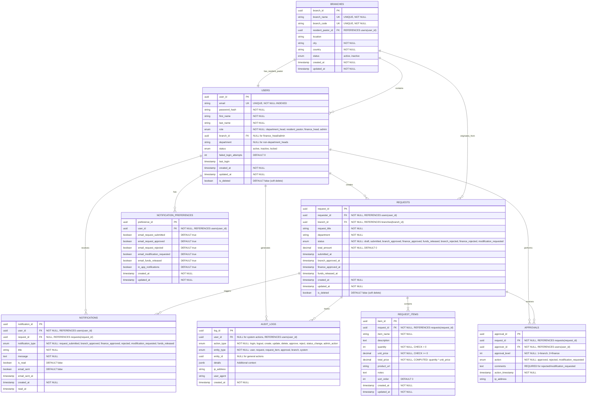

# Entity Relationship Diagram

```mermaid
erDiagram
    USERS ||--o{ REQUESTS : "creates"
    USERS ||--o{ APPROVALS : "performs"
    USERS ||--o{ AUDIT_LOGS : "generates"
    BRANCHES ||--|| USERS : "has_resident_pastor"
    BRANCHES ||--o{ USERS : "contains"
    BRANCHES ||--o{ REQUESTS : "originates_from"
    REQUESTS ||--|{ REQUEST_ITEMS : "contains"
    REQUESTS ||--o{ APPROVALS : "receives"
    REQUESTS ||--o{ AUDIT_LOGS : "tracks"
    USERS ||--o{ NOTIFICATION_PREFERENCES : "has"
    USERS ||--o{ NOTIFICATIONS : "receives"
    REQUESTS ||--o{ NOTIFICATIONS : "triggers"

    USERS {
        uuid user_id PK
        string email UK "UNIQUE, NOT NULL INDEXED"
        string password_hash "NOT NULL"
        string first_name "NOT NULL"
        string last_name "NOT NULL"
        enum role "NOT NULL: department_head, resident_pastor, finance_head, admin"
        uuid branch_id FK "NULL for finance_head/admin"
        string department "NULL for non-department_heads"
        enum status "active, inactive, locked"
        int failed_login_attempts "DEFAULT 0"
        timestamp last_login
        timestamp created_at "NOT NULL"
        timestamp updated_at "NOT NULL"
        boolean is_deleted "DEFAULT false (soft delete)"
    }

    BRANCHES {
        uuid branch_id PK
        string branch_name UK "UNIQUE, NOT NULL"
        string branch_code UK "UNIQUE, NOT NULL"
        uuid resident_pastor_id FK "REFERENCES users(user_id)"
        string location
        string city "NOT NULL"
        string country "NOT NULL"
        enum status "active, inactive"
        timestamp created_at "NOT NULL"
        timestamp updated_at "NOT NULL"
    }

    REQUESTS {
        uuid request_id PK
        uuid requester_id FK "NOT NULL, REFERENCES users(user_id)"
        uuid branch_id FK "NOT NULL, REFERENCES branches(branch_id)"
        string request_title "NOT NULL"
        string department "NOT NULL"
        enum status "NOT NULL: draft, submitted, branch_approved, finance_approved, funds_released, branch_rejected, finance_rejected, modification_requested"
        decimal total_amount "NOT NULL, DEFAULT 0"
        timestamp submitted_at
        timestamp branch_approved_at
        timestamp finance_approved_at
        timestamp funds_released_at
        timestamp created_at "NOT NULL"
        timestamp updated_at "NOT NULL"
        boolean is_deleted "DEFAULT false (soft delete)"
    }

    REQUEST_ITEMS {
        uuid item_id PK
        uuid request_id FK "NOT NULL, REFERENCES requests(request_id)"
        string item_name "NOT NULL"
        text description
        int quantity "NOT NULL, CHECK > 0"
        decimal unit_price "NOT NULL, CHECK >= 0"
        decimal total_price "NOT NULL, COMPUTED: quantity * unit_price"
        string product_url
        text notes
        int sort_order "DEFAULT 0"
        timestamp created_at "NOT NULL"
        timestamp updated_at "NOT NULL"
    }

    APPROVALS {
        uuid approval_id PK
        uuid request_id FK "NOT NULL, REFERENCES requests(request_id)"
        uuid approver_id FK "NOT NULL, REFERENCES users(user_id)"
        int approval_level "NOT NULL: 1=branch, 2=finance"
        enum action "NOT NULL: approved, rejected, modification_requested"
        text comments "REQUIRED for rejected/modification_requested"
        timestamp action_timestamp "NOT NULL"
        string ip_address
    }

    AUDIT_LOGS {
        uuid log_id PK
        uuid user_id FK "NULL for system actions, REFERENCES users(user_id)"
        enum action_type "NOT NULL: login, logout, create, update, delete, approve, reject, status_change, admin_action"
        enum entity_type "NOT NULL: user, request, request_item, approval, branch, system"
        uuid entity_id "NULL for general actions"
        jsonb details "Additional context"
        string ip_address
        string user_agent
        timestamp created_at "NOT NULL"
    }

    NOTIFICATION_PREFERENCES {
        uuid preference_id PK
        uuid user_id FK "NOT NULL, REFERENCES users(user_id)"
        boolean email_request_submitted "DEFAULT true"
        boolean email_request_approved "DEFAULT true"
        boolean email_request_rejected "DEFAULT true"
        boolean email_modification_requested "DEFAULT true"
        boolean email_funds_released "DEFAULT true"
        boolean in_app_notifications "DEFAULT true"
        timestamp created_at "NOT NULL"
        timestamp updated_at "NOT NULL"
    }

    NOTIFICATIONS {
        uuid notification_id PK
        uuid user_id FK "NOT NULL, REFERENCES users(user_id)"
        uuid request_id FK "NULL, REFERENCES requests(request_id)"
        enum notification_type "NOT NULL: request_submitted, branch_approved, finance_approved, rejected, modification_requested, funds_released"
        string title "NOT NULL"
        text message "NOT NULL"
        boolean is_read "DEFAULT false"
        boolean email_sent "DEFAULT false"
        timestamp email_sent_at
        timestamp created_at "NOT NULL"
        timestamp read_at
    }
```
